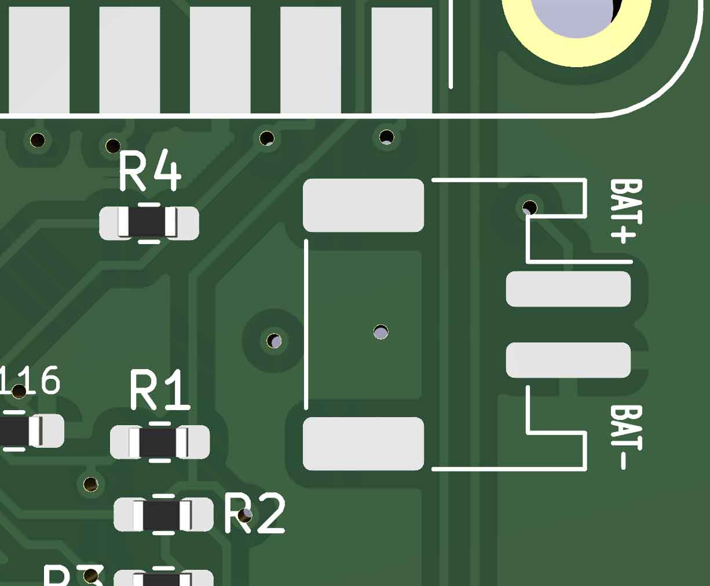

**SHARPIKEEBO – Version 2025 (Public Release)
**

**sharpikeebo – V2025
Miniature Raspberry Pi Zero 2W shield with Sharp Memory Display and USB Keyboard
**
This repository now documents the public 2025 version of the SHARPIKEEBO, distributed after the successful crowdfunding campaign on
Crowd Supply: https://www.crowdsupply.com/morpheans/sharpikeebo

All hardware described here corresponds to the final production version delivered to backers and the public.

Overview

Hello all,

This is the SHARPIKEEBO Nano Computer Shield, built around the famous Raspberry Pi Zero 2W, featuring:

- A high-quality Sharp Memory Display (400 × 240 pixels)
- A true USB keyboard, powered by QMK firmware
(https://docs.qmk.fm/#/)
- An ATmega32U4 microcontroller
- A compact form factor designed as a real miniature Linux terminal

The SHARPIKEEBO was initially designed as a portable SSH and system administration tool, allowing administrators to quickly connect to servers and perform maintenance operations.
During development, many users also pointed out its potential as a retro or lightweight gaming platform.

**Hardware Description
**

The SHARPIKEEBO carrier board is designed to host:

- A Raspberry Pi Zero 2W or Zero W
- A 2.7" Sharp Memory Display (400 × 240) capable of fast refresh rates, suitable for:
  Linux shells
  Text-based interfaces
  Simple graphical games
  Additional features include:

- Controllable LEDs (GPIO, usable from C++ or Python)
- Easily accessible UART and I²C GPIOs for external modules:
  GPS
  4G / 5G modem
  Other 3.3 V or 5 V peripherals

Power is supplied via USB-C, and the board can also behave as a USB keyboard device when plugged into a desktop, laptop, or rack server.

**IMPORTANT CHANGES & CLARIFICATION (READ CAREFULLY)
**
This section is critical for proper operation of the 2025 public hardware.

**Raspberry Pi Zero mounting orientation (VERY IMPORTANT)
**

The Raspberry Pi Zero must be mounted with its connector facing DOWN

This means the components of the Raspberry Pi remain visible

DO NOT use a 20×2 pin header mounted on the TOP side

If the Raspberry Pi is connected using a top-mounted 20×2 pin header, the board will NOT work

 This is not optional and is required by the electrical design of the SHARPIKEEBO.

 Battery polarity warning
**** 

Some batteries on the market do NOT follow standard polarity orientation

Incorrect polarity can permanently damage the board

 Always verify battery polarity against the schematics before connecting
 Never assume wire colors are correct

**RAK Wireless module interface
**
The RAK Wireless module is connected in UART mode

It is NOT wired in SPI mode

 Any software configuration must therefore use UART, not SPI.
Factory testing guarantee

Every single SHARPIKEEBO unit shipped has been individually tested

All boards were:
- Powered
- Verified
- Confirmed fully functional before shipping

If you encounter an issue, it is almost always related to:
- Incorrect Raspberry Pi mounting
- Battery polarity inversion
- Incorrect peripheral wiring or configuration
- Status

This repository now reflects the final, stable, production hardware shipped after the Crowd Supply campaign.
Future updates will focus on software examples, configurations, and community contributions, not hardware changes.
